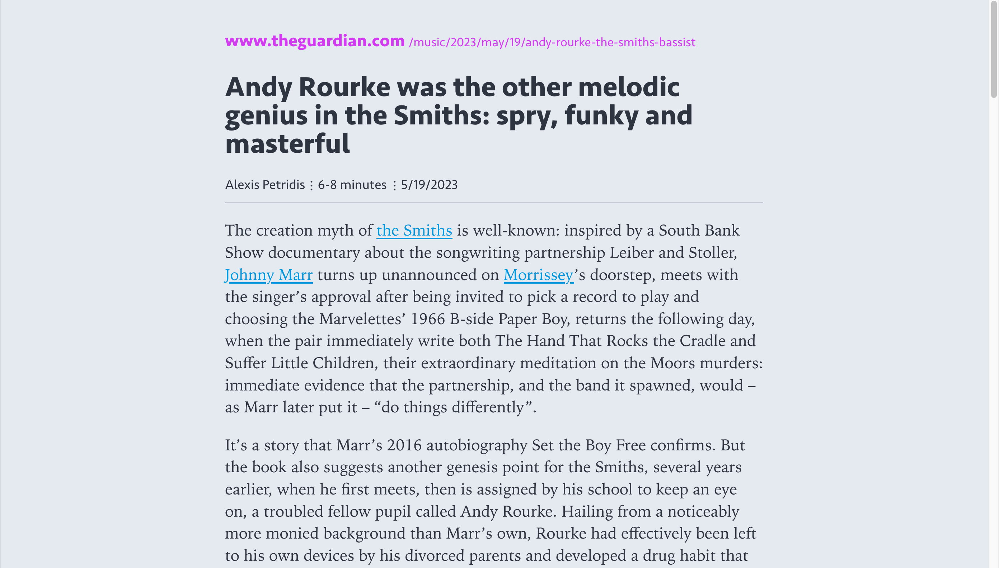
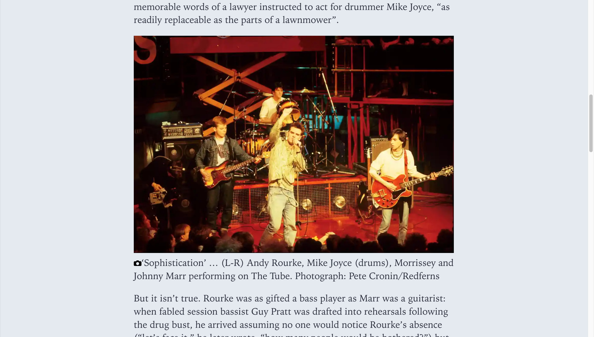
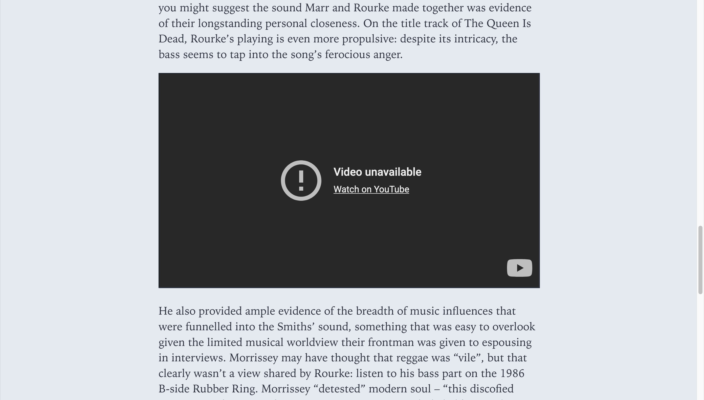

# Reader View (browser extension) - Custom CSS

Extension homepage: https://webextension.org/listing/chrome-reader-view.html

Featuring the same typography used of other interfaces I've been using:

- Seravek for headings and UI elements
- Iowan Old Style for body copy

## Examples

***

***

